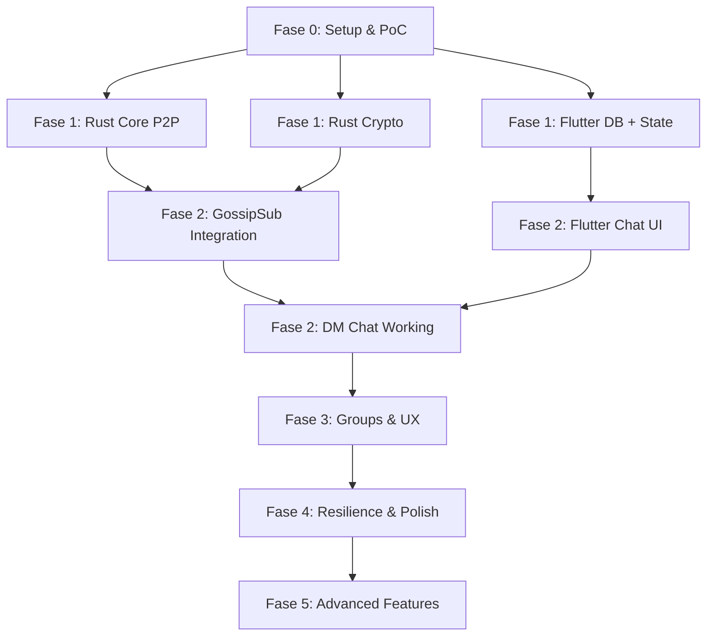

# P2P GossipSub Chat App — Implementation Plan

> Berdasarkan analisis [blueprint_v2.0.md](file:///c:/Users/mawan/OneDrive/Desktop/message-p2p/blueprint_v2.0.md)
> 
> **Status**: ✅ APPROVED — Mulai eksekusi Fase 0–2

## Keputusan Final

| Keputusan | Pilihan |
|---|---|
| Target Platform Awal | **Android first** |
| Bootstrap/Discovery | **mDNS (LAN) + Kademlia DHT (public) + Invite link** — tanpa VPS |
| State Management | **Riverpod** (modern, code-gen friendly) |
| Database | **Drift** (type-safe, modern) — mengganti sqflite |
| Crypto Library | **dryoc** (pure Rust, NaCl-compatible) — mengganti sodiumoxide (deprecated) |
| Testing Devices | 2 HP fisik Android |
| CI/CD | Nanti saja |
| Scope Awal | Fase 0 → Fase 2 (full unit tests) |

## Ringkasan

Membangun aplikasi chat mobile (Android first, iOS nanti) yang **sepenuhnya terdesentralisasi** menggunakan stack **Flutter + Rust (rust-libp2p + flutter_rust_bridge)**. Tidak ada server pusat — setiap device adalah node P2P dalam jaringan mesh GossipSub. Pesan dienkripsi end-to-end menggunakan NaCl-compatible crypto (dryoc).

**Stack utama:**
- **UI Layer**: Flutter/Dart + Riverpod (state management) + go_router (navigation)
- **P2P Core**: Rust + rust-libp2p **0.56** (GossipSub, Kad-DHT, mDNS, Noise, WebRTC)
- **FFI Bridge**: flutter_rust_bridge **2.12**
- **Crypto**: **dryoc** (pure Rust NaCl-compatible: box/secretbox), ed25519-dalek, x25519-dalek
- **Storage**: **Drift 2.33** (type-safe SQLite) + flutter_secure_storage (Keychain/Keystore)

---

## Perubahan dari Blueprint v2.0

> [!IMPORTANT]
> **Dependency Updates** — Beberapa perubahan penting dari blueprint asli:

| Blueprint v2.0 | Implementasi Aktual | Alasan |
|---|---|---|
| `sodiumoxide` | **`dryoc`** | sodiumoxide deprecated sejak 2021, dryoc adalah drop-in replacement NaCl API yang pure Rust |
| `libp2p = "0.54"` | **`libp2p = "0.56"`** | Versi terbaru stabil, dropped async-std (tokio only) |
| `flutter_rust_bridge: ^2.0.0` | **`^2.12.0`** | Versi terbaru dengan SSE codec, improved async |
| `sqflite` | **`drift ^2.33`** | Type-safe SQL, code generation, better migration support |

---

## Proposed Changes

Implementasi dibagi menjadi **6 fase** mengikuti blueprint, dengan detail file-level.

> [!NOTE]
> Scope saat ini: **Fase 0 → Fase 2** dengan unit tests lengkap di setiap fase.

---

### FASE 0 — Migration & Setup (Minggu 1–2)

> Goal: Environment setup, Flutter + Rust project scaffold, proof-of-concept FFI call.

#### [NEW] Project Root Setup

- Inisialisasi Flutter project menggunakan `flutter create` dengan template
- Integrasi `flutter_rust_bridge` menggunakan template/codegen
- Setup Cargo workspace di root project

#### [NEW] `rust/Cargo.toml`
- Setup Rust library dengan `crate-type = ["cdylib", "staticlib"]`
- Dependencies minimal: `libp2p` (fitur: gossipsub, kad, mdns, noise, yamux, tcp), `tokio`, `flutter_rust_bridge`, `serde`, `serde_json`, `anyhow`, `log`

#### [NEW] `rust/src/lib.rs`
- Entry point flutter_rust_bridge
- Expose fungsi PoC: `hello_from_rust()`, `start_minimal_node() -> String`

#### [NEW] `rust/src/api/mod.rs`
- Module deklarasi untuk public API

#### [NEW] `rust/src/api/node_api.rs`
- `start_node()` — start minimal libp2p node, return PeerID
- `stop_node()` — graceful shutdown
- `peer_count() -> u32` — jumlah connected peers
- `node_status() -> NodeStatus` — enum status node

#### [NEW] Build scripts
- `build_android.sh` — cross-compile Rust ke Android (aarch64, armv7, x86_64, i686)
- `build_ios.sh` — cross-compile Rust ke iOS (aarch64-apple-ios, x86_64-apple-ios-sim)

**Verification:**
- `flutter run` berhasil di emulator Android
- Dart bisa call `hello_from_rust()` dan mendapat response
- `start_minimal_node()` return valid PeerID string

---

### FASE 1 — Foundation (Minggu 3–6)

> Goal: Rust core P2P + crypto, Flutter database + state management + basic UI shell.

#### Rust Core — P2P Node

#### [NEW] `rust/src/p2p/mod.rs`
- Module deklarasi: node, gossipsub, discovery, relay, topics

#### [NEW] `rust/src/p2p/node.rs`
- `P2PNode` struct — wraps libp2p Swarm
- `create_swarm()` — konfigurasi transport (TCP + QUIC), security (Noise), muxer (Yamux)
- `run_event_loop()` — async event loop yang memproses SwarmEvents
- Callback channel ke Flutter via flutter_rust_bridge streams

#### [NEW] `rust/src/p2p/gossipsub.rs`
- `build_gossipsub_config()` — mesh params D=6, Dlo=4, Dhi=12
- `build_gossipsub_behaviour()` — message validation, scoring
- Handler untuk `GossipsubEvent::Message` → forward ke Flutter

#### [NEW] `rust/src/p2p/discovery.rs`
- Kademlia DHT setup + bootstrap nodes
- mDNS setup untuk LAN discovery
- `find_peer(peer_id)` → lookup di DHT
- `provide_self()` → announce diri di DHT

#### [NEW] `rust/src/p2p/relay.rs`
- Circuit Relay v2 client setup
- DCUtR (Direct Connection Upgrade through Relay)

#### [NEW] `rust/src/p2p/topics.rs`
- `dm_topic(peer_a, peer_b) -> String` — sorted peer IDs
- `group_topic(group_id) -> String`
- `presence_topic(peer_id) -> String`
- `invite_topic(target_peer_id) -> String`

---

#### Rust Core — Crypto & Identity

#### [NEW] `rust/src/crypto/mod.rs`
- Module deklarasi

#### [NEW] `rust/src/crypto/identity.rs`
- `generate_keypair()` — Ed25519 signing keypair + X25519 box keypair
- `peer_id_from_pubkey()` — derive PeerID dari Ed25519 public key
- `export_identity()` / `import_identity()` — serialisasi keypair

#### [NEW] `rust/src/crypto/dm_crypto.rs`
- `encrypt_dm(plaintext, recipient_pub, sender_secret) -> DMPayload`
- `decrypt_dm(payload, recipient_secret) -> Vec<u8>`
- Menggunakan `sodiumoxide::crypto::box_` (NaCl box: X25519 + XSalsa20-Poly1305)

#### [NEW] `rust/src/crypto/group_crypto.rs`
- `encrypt_group(plaintext, group_key) -> GroupPayload`
- `decrypt_group(payload, group_key) -> Vec<u8>`
- `generate_group_key() -> Vec<u8>` — random 32 bytes
- Menggunakan `sodiumoxide::crypto::secretbox` (NaCl secretbox)

#### [NEW] `rust/src/crypto/keystore.rs`
- In-memory key management (runtime only, persistent storage di Flutter side)
- `set_identity_keys()`, `get_signing_key()`, `get_box_key()`

---

#### Rust Core — Models

#### [NEW] `rust/src/models/mod.rs`
#### [NEW] `rust/src/models/message.rs`
- `MessageEnvelope`, `MessageType`, `DMPayload`, `GroupPayload`, `ChatMessage`, `ContentType`
- Serde derive untuk serialisasi JSON

#### [NEW] `rust/src/models/contact.rs`
- `ContactCard` — peer_id, pub_key, sign_pub_key, multiaddrs, display_name

#### [NEW] `rust/src/models/group.rs`
- `GroupInfo` — id, name, topic, admin_peer_id, members

---

#### Rust API Layer (exposed ke Flutter)

#### [NEW] `rust/src/api/chat_api.rs`
- `send_dm(target_peer_id, content, content_type) -> Result<String>`
- `send_group_message(group_id, content, content_type) -> Result<String>`

#### [NEW] `rust/src/api/discovery_api.rs`
- `connect_peer(multiaddr) -> Result<()>`
- `find_peer(peer_id) -> Result<Vec<String>>` (multiaddrs)

#### [NEW] `rust/src/api/crypto_api.rs`
- `generate_identity() -> IdentityInfo`
- `encrypt_dm_message(...)` / `decrypt_dm_message(...)`
- `sign_envelope(...)` / `verify_envelope(...)`

---

#### Flutter — Database SQLite

#### [NEW] `lib/src/core/database/database_helper.dart`
- SQLite initialization, schema creation, migration system
- Full schema dari blueprint Bagian 6 (7 tabel: identity, contacts, conversations, messages, groups, group_members, message_queue, schema_version)

#### [NEW] `lib/src/core/database/dao/identity_dao.dart`
- CRUD operations untuk tabel `identity`

#### [NEW] `lib/src/core/database/dao/contacts_dao.dart`
- CRUD operations untuk tabel `contacts`

#### [NEW] `lib/src/core/database/dao/conversations_dao.dart`
- CRUD operations untuk tabel `conversations`

#### [NEW] `lib/src/core/database/dao/messages_dao.dart`
- CRUD operations untuk tabel `messages`
- Pagination support (LIMIT/OFFSET)

#### [NEW] `lib/src/core/database/dao/groups_dao.dart`
- CRUD operations untuk tabel `groups` + `group_members`

#### [NEW] `lib/src/core/database/dao/message_queue_dao.dart`
- CRUD operations untuk tabel `message_queue`

---

#### Flutter — State Management (Riverpod)

#### [NEW] `lib/src/core/services/chat_service.dart`
- Business logic: send/receive DM, handle ACK, message dedup

#### [NEW] `lib/src/core/services/notification_service.dart`
- Wrapper untuk flutter_local_notifications

#### [NEW] `lib/src/features/chat/presentation/providers/chat_provider.dart`
- `chatProvider` — messages per conversation (Riverpod)
- `chatListProvider` — sorted conversation list

#### [NEW] `lib/src/features/contacts/presentation/providers/contacts_provider.dart`
- `contactsProvider` — daftar kontak

#### [NEW] `lib/src/features/groups/presentation/providers/groups_provider.dart`
- `groupsProvider` — daftar grup + membership

#### [NEW] `lib/src/core/services/node_status_provider.dart`
- `nodeStatusProvider` — status node, peer count dari Rust stream

---

#### Flutter — Key Storage

#### [NEW] `lib/src/core/services/keystore_service.dart`
- Menggunakan `flutter_secure_storage`
- `storeIdentityKey()`, `loadIdentityKey()`
- `storeGroupKey(groupId)`, `loadGroupKey(groupId)`
- `deleteGroupKey(groupId)`

---

#### Flutter — Router & Theme

#### [NEW] `lib/src/core/router/app_router.dart`
- go_router setup dengan semua route definitions

#### [NEW] `lib/src/core/theme/app_theme.dart`
- Material 3 theme (dark + light mode)
- Color palette, typography, shape theme

#### [NEW] `lib/main.dart`
- App entry point: ProviderScope, MaterialApp.router

**Verification Fase 1:**
- Rust unit tests: `cargo test` — semua crypto roundtrip pass
- Rust integration test: 2 node lokal bisa connect via mDNS
- Flutter unit tests: semua DAO CRUD operations
- Flutter bisa start/stop Rust node via FFI

---

### FASE 2 — Core P2P Chat (Minggu 7–10)

> Goal: Working DM chat antara 2 device, contact discovery via QR, presence system, basic UI.

#### Rust — GossipSub & Discovery Integration

#### [MODIFY] `rust/src/api/chat_api.rs`
- Implementasi full `send_dm()` flow: serialize → encrypt → sign → publish GossipSub
- Implementasi `on_message` stream ke Flutter

#### [MODIFY] `rust/src/p2p/node.rs`
- Event loop handles: message received → decrypt → verify sig → forward ke Flutter
- Peer connect/disconnect events → callback ke Flutter

#### [MODIFY] `rust/src/api/discovery_api.rs`
- `connect_to_peer(multiaddr)` — full implementation dengan retry

---

#### Flutter — Contact Discovery (QR)

#### [NEW] `lib/src/features/contacts/presentation/screens/add_contact_screen.dart`
- QR code generator (qr_flutter) — encode ContactCard JSON
- QR code scanner (mobile_scanner) — decode + validate + save

#### [NEW] `lib/src/features/contacts/data/contact_repository.dart`
- `generateContactCard()` — buat JSON data kontak diri dari identity
- `saveContactFromQR(data)` — parse, validate, simpan ke SQLite

---

#### Flutter — Private DM

#### [NEW] `lib/src/features/chat/data/chat_repository.dart`
- `sendDM(targetPeerId, content)` — call Rust encrypt + publish
- `receiveDM(envelope)` — call Rust decrypt, simpan ke SQLite
- Message deduplication (cek UUID di database)
- ACK handling

---

#### Flutter — Presence System

#### [NEW] `lib/src/core/services/presence_service.dart`
- Heartbeat timer: publish presence setiap 30 detik via Rust
- Subscribe ke presence topic kontak
- Timeout logic: 90 detik tanpa heartbeat → offline
- Update contact status di database + notify provider

---

#### Flutter UI — Onboarding Screens

#### [NEW] `lib/src/features/onboarding/presentation/screens/splash_screen.dart`
#### [NEW] `lib/src/features/onboarding/presentation/screens/welcome_screen.dart`
#### [NEW] `lib/src/features/onboarding/presentation/screens/generate_keys_screen.dart`
- Trigger Rust `generate_identity()` dengan loading animation
#### [NEW] `lib/src/features/onboarding/presentation/screens/setup_profile_screen.dart`
- Display name + avatar input
#### [NEW] `lib/src/features/onboarding/presentation/screens/tutorial_screen.dart`
- P2P concept explanation

---

#### Flutter UI — Chat List & Chat Screen

#### [NEW] `lib/src/features/chat/presentation/screens/chat_list_screen.dart`
- Sorted by last_message_at DESC
- FAB: New Chat
- Pull-to-refresh, swipe actions

#### [NEW] `lib/src/features/chat/presentation/screens/chat_screen.dart`
- Message list (ListView.builder)
- Chat input bar + send button
- Auto-scroll, keyboard avoidance
- Long-press menu (Copy, Reply, Delete)
- Reply preview bar

#### [NEW] `lib/src/shared/widgets/chat_bubble.dart`
- Sent/received styling
- Timestamp, status icon (⏳ → ✓ → ✓✓ → ✓✓🔵)
- Reply indicator

#### [NEW] `lib/src/shared/widgets/chat_input.dart`
- Text input + send button + attachment button (future)

#### [NEW] `lib/src/shared/widgets/chat_list_item.dart`
- Avatar, name, preview, timestamp, unread badge

**Verification Fase 2:**
- 2 device fisik (atau emulator) bisa:
  - Scan QR → add contact
  - Send DM → receive & decrypt → display
  - See online/offline status
- ACK flow works (✓ → ✓✓)

---

### FASE 3 — Grup & UX (Minggu 11–14)

> Goal: Group chat working, contact management polished, settings, notifications.

#### Rust — Group Chat Backend

#### [MODIFY] `rust/src/api/chat_api.rs`
- `create_group(name) -> GroupInfo` — generate UUID + symmetric key
- `invite_member(group_id, target_peer_id)` — encrypt group key dengan NaCl box
- `accept_invite(encrypted_invite)` — decrypt, verify admin sig, subscribe topic
- `leave_group(group_id)` — unsubscribe, notify
- `remove_member(group_id, peer_id)` — admin only, trigger key rotation
- `rotate_group_key(group_id)` — generate new key, re-distribute

---

#### Flutter UI — Group Screens

#### [NEW] `lib/src/features/groups/presentation/screens/create_group_screen.dart`
#### [NEW] `lib/src/features/groups/presentation/screens/group_chat_screen.dart`
#### [NEW] `lib/src/features/groups/presentation/screens/group_info_screen.dart`
#### [NEW] `lib/src/features/groups/presentation/screens/invite_member_screen.dart`
#### [NEW] `lib/src/shared/widgets/member_list_item.dart`

---

#### Flutter UI — Contact Screens

#### [NEW] `lib/src/features/contacts/presentation/screens/contact_list_screen.dart`
#### [NEW] `lib/src/features/contacts/presentation/screens/contact_profile_screen.dart`
#### [MODIFY] `lib/src/features/contacts/presentation/screens/add_contact_screen.dart`
- Add share profile via share_plus

---

#### Flutter UI — Settings

#### [NEW] `lib/src/features/settings/presentation/screens/settings_screen.dart`
- Edit profile, network stats, PeerID + QR
- Toggle notifications, online status
- Export backup, delete all data

---

#### Notifications

#### [MODIFY] `lib/src/core/services/notification_service.dart`
- Permission request flow
- Local notification saat DM masuk (background)
- Local notification saat @mention di grup
- Deep link: tap notification → navigate ke chat screen

**Verification Fase 3:**
- Group chat: create → invite → chat → leave → key rotation works
- Contact management: block, delete, edit name
- Notifications: DM + group @mention → local notification → tap navigates

---

### FASE 4 — Resilience & Polish (Minggu 15–18)

> Goal: Offline queue, NAT optimization, performance polish, testing, App Store prep.

#### Offline Message Queue

#### [NEW] `lib/src/core/services/message_queue_service.dart`
- Exponential backoff retry (1s, 2s, 4s, 8s... max 5m)
- Trigger retry saat peer reconnect (dari Rust callback)
- Max 10 retries, lalu mark as failed

#### NAT Traversal Optimization

#### [MODIFY] `rust/src/p2p/node.rs`
- Transport priority: mDNS → QUIC → WebRTC → DCUtR → Circuit Relay
- STUN server config (stun.l.google.com)
- Auto-reconnect logic

#### Performance & UX Polish

#### [MODIFY] Multiple Flutter UI files
- ListView.builder virtualization
- SQLite pagination
- Page transitions & Hero animations
- Skeleton loading (shimmer)
- Dark mode support
- Haptic feedback

#### Testing

- Rust: `cargo test` — >90% coverage crypto, node lifecycle
- Flutter: unit tests (DAO), widget tests (ChatBubble, ChatInput), integration tests (onboarding)
- E2E: DM (2 device), group (3+ device), cross-platform (iOS ↔ Android)

#### App Store Preparation

- Android keystore + iOS certificates
- App icon (1024x1024)
- Screenshots
- App description (EN + ID)

---

### FASE 5 — Advanced Features (Minggu 19–26)

> Goal: Voice note, file sharing, disappearing messages, multi-device, beta release.

#### Voice Note
- Flutter: `record` package untuk rekam audio
- Rust: file transfer via libp2p request-response
- UI: waveform visualizer + playback (`just_audio`)

#### File Sharing
- Rust: custom protocol `/p2pchat/file/1.0.0`
- Flutter: progress indicator, image preview in bubble

#### Disappearing Messages
- Toggle di conversation settings
- Background task auto-delete

#### Multi-Device
- QR code link device baru
- Transfer keypair via short-lived encrypted channel
- Sync message history

#### Beta Release
- Google Play Internal Track (AAB)
- TestFlight (IPA)
- Landing page, documentation, changelog

---

## Verification Plan

### Automated Tests

| Layer | Tool | Coverage Target |
|---|---|---|
| Rust crypto | `cargo test` | >90% — roundtrip encrypt/decrypt, sign/verify |
| Rust P2P | `cargo test` (integration) | Node lifecycle, 2-node connect, message exchange |
| Flutter DAO | `flutter test` | 100% — all CRUD operations |
| Flutter widgets | `flutter test` (widget) | ChatBubble, ChatInput, ChatListItem |
| Flutter integration | `flutter test integration_test/` | Onboarding flow, send DM flow |

### Manual Verification

| Test | Description |
|---|---|
| QR contact exchange | 2 device fisik: scan QR → contact appears |
| DM flow | Device A send → Device B receive & decrypt → ACK back |
| Group flow | Create → invite → chat → leave → key rotation |
| Offline queue | Send saat offline → auto-retry saat reconnect |
| NAT traversal | Test di jaringan berbeda (WiFi vs mobile data) |
| Cross-platform | iOS ↔ Android interop |
| App Store | Build release APK/IPA → install di device fisik |

---

## Dependency Order

> **Rekomendasi**: Mulai dari **Fase 0** untuk memastikan Flutter + Rust bridge bekerja di environment Anda sebelum membangun fitur. Ini adalah langkah paling kritikal karena cross-compilation Rust ke mobile bisa memiliki gotcha yang spesifik per environment.
